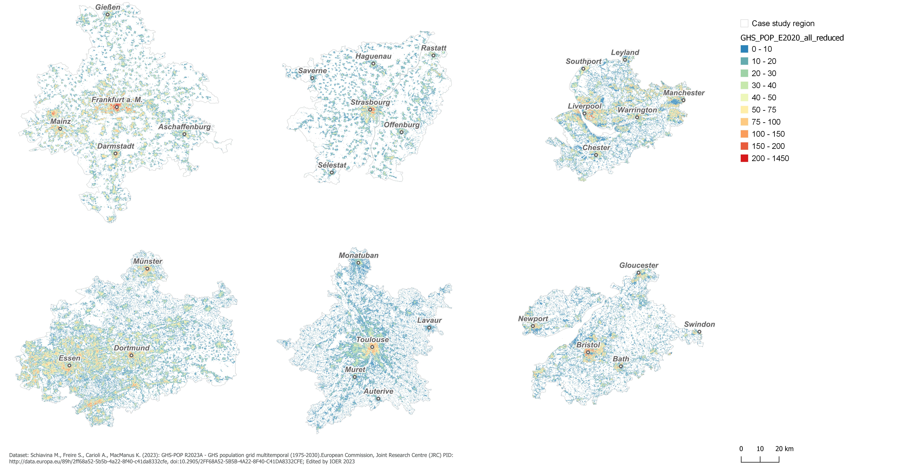
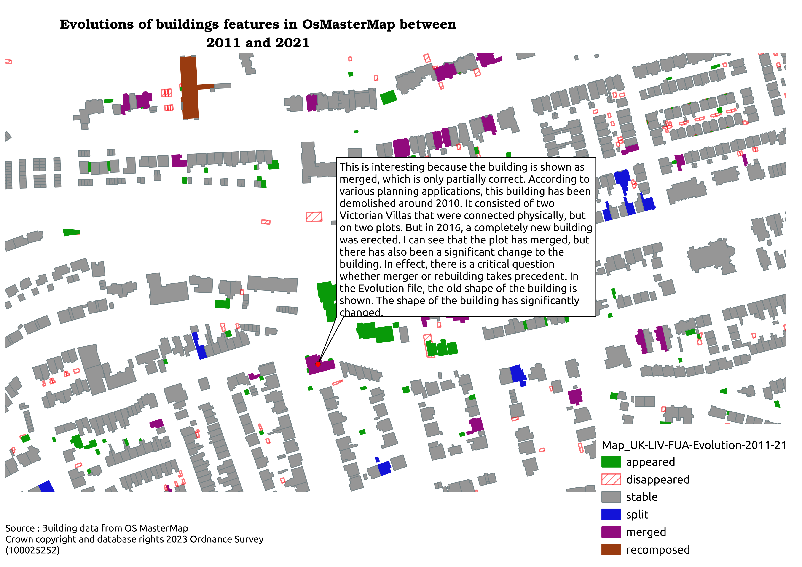
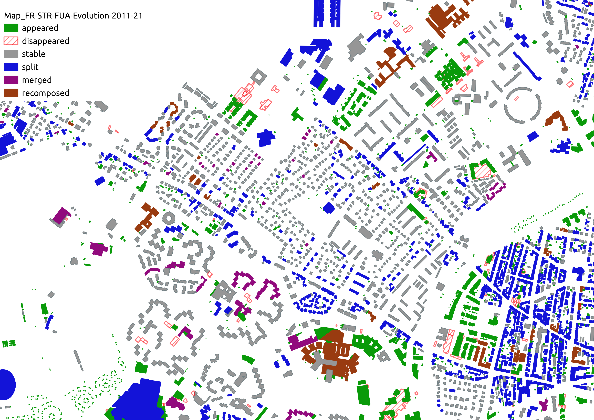

# Maps

List of maps and associated description. This list is very important to give shared identifiers to maps within the dashboard and ensure that statements referring in an un ambiguous manner to maps can be shared. 

A description can be enclosed in this registry or in a separate file.

*******
 
 1. [Map_GHS_POP_ALLCSR_2020](#map_ghs_pop_allcsr_2020)
 2. [Map_UK-LIV-FUA-Evolution-2011-21](#map_uk-liv-fua-evolution-2011-21)
 3. [Map_DE-DOR-FUA-Evolution-2011-21](#map_de-dor-fua-evolution-2011-21)
 4. [Map_FR-STR-FUA-Evolution-2011-21](#map_fr-str-fua-evolution-2011-21)
 6. [Map description template](#map-description-template)
*******

## Map_GHS_POP_ALLCSR_2020
* **Title** : Overview of population density within casestudy regions
* **Provenance** : The map was produced with the process CreateGHS_POP_2020_ALLCSR_reduced
* **Usages** : 

## Map_UK-LIV-FUA-Evolution-2011-21
* **Title** : Evolutions of buildings in Liverpool functional area between 2011 and 2021
* **Provenance** :This map was created using dataset UK-LIV-FUA-Evolution-2011-21, i.e. data from the OSMASTERMAP database spanning from 2011 to 2021 in Liverpool.
* **Usages** : 
* **Access** : the map is a geopackage containing data and stylesheet that can be loaded locally on QGIS to be read thoroughly and possibly annotated

## Map_DE-DOR-FUA-Evolution-2011-21
* **Title** : Evolutions of buildings in Dortmund functional area between 2011 and 2021
* **Provenance** :This map was created using dataset DE-DOR-FUA-Evolution-2011-21, i.e. data from the ATKIS database spanning from 2011 to 2021 in Dortmund.
* **Usages** : 
* **Access** : the map is a geopackage containing data and stylesheet that can be loaded locally on QGIS to be read thoroughly and possibly annotated

## Map_FR-STR-FUA-Evolution-2011-21
* **Title** : Evolutions of buildings in Strasbourg functional area betwwen 2011 and 2021 
* **Provenance** :This map was created by portraying the result of a process ComputeBuildingEvolution applied to BDTopo building data at two timestamps, 2011 and 2021, on Strasbourg. Only a sample is displayed here and the full geopackage map can be obtained by asking the author. 
* **Usages** :
* **Access** : the map is a geopackage containing data and stylesheet that can be loaded locally on QGIS to be read thoroughly and possibly annotated

## Map-description-template
* **Title** : Title of the map, to be displayed on the webpage
* **Styles** : Caption describing the Keys/Styles (possibly name of  a jpeg file put in the same folder) if they are not integrated with the map picture
* **Provenance** : Textual description of how the map was produced, what keys were used. This description can get enriched while the dataset is revised and improved (quality check and so on).
* **Usages** : References to narratives that have been produced with this dataset
* **Feedback** : Comments related to the map, interpretation, identification of quality issues and so on
* **Access, Copyright** : 
 

